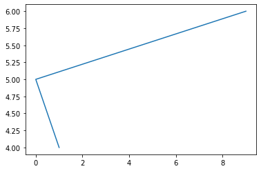
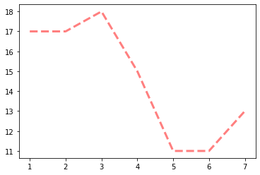
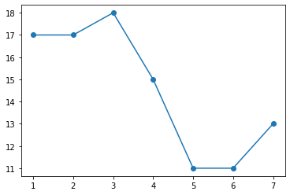
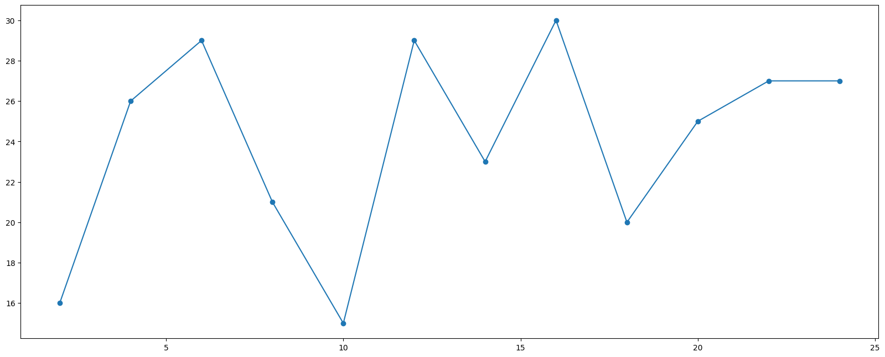
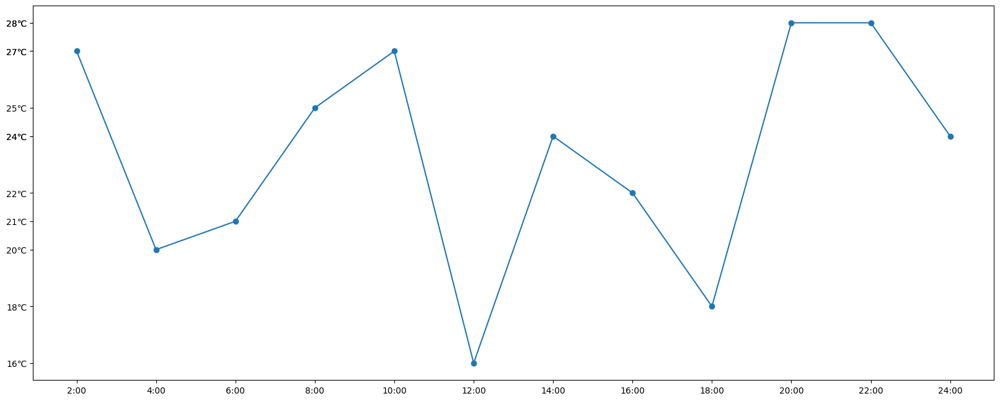
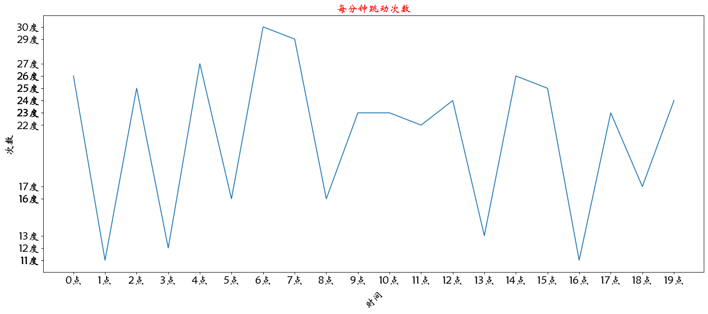
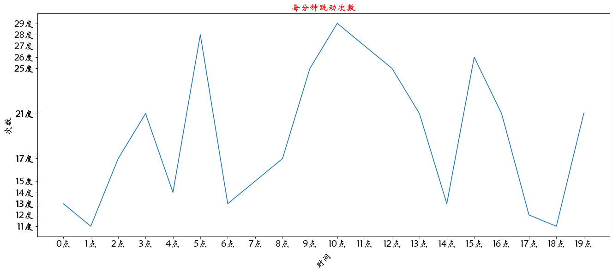

## matplotlib

- Matplotlib是一个Python 2D绘图库，它可以在各种平台上以各种硬拷贝格式和交互式环境生成出具有
出版品质的图形。 Matplotlib可用于Python脚本，Python和IPython shell，Jupyter笔记本，Web应用
程序服务器和四个图形用户界面工具包。
Matplotlib试图让简单的事情变得更简单，让无法实现的事情变得可能实现。 只需几行代码即可生成绘
图，直方图，功率谱，条形图，错误图，散点图等。
为了简单绘图，pyplot模块提供了类似于MATLAB的界面，特别是与IPython结合使用时。 对于高级用
户，您可以通过面向对象的界面或MATLAB用户熟悉的一组函数完全控制线条样式，字体属性，轴属性
等。


```python
import matplotlib.pyplot as plt
# 在jupyter中执行的时候显示图片 
#%matplotlib inline 
# 传入x和y, 通过plot画图 
plt.plot([1, 0, 9], [4, 5, 6]) 
# 在执行程序的时候展示图形 
plt.show()
```


    

    


## 折线图


```python
from matplotlib import pyplot as plt 
x = range(1,8) 
# for i in x :
#   print(i)
# x轴的位置 
y = [17, 17, 18, 15, 11, 11, 13] 
# 传入x和y, 通过plot画折线图 
plt.plot(x,y,color='red',alpha=0.5,linestyle='--',linewidth=3) 
plt.show()
# show已经销毁
plt.plot(x,y,marker='o') 
plt.show()
```


    

    


    

    


### 基础属性设置 
    color='red' : 折线的颜色 
    alpha=0.5 : 折线的透明度(0-1)
    linestyle='--' : 折线的样式 
    linewidth=3 : 折线的宽度 
### 线的样式 
  - 实线(solid) 
  - 短线(dashed) 
  - 短点相间线(dashdot) 
  - 虚点线(dotted)
  
### 设置图片的大小 
  - figsize:指定figure的宽和高，单位为英寸； 
  - dpi参数指定绘图对象的分辨率，即每英寸多少个像素，缺省值为80 1英寸等于2.5cm,A4纸是 21*30cm的纸张
  - plt.savefig('./t1.png')


```python
import matplotlib.pyplot as plt
import random
x=range(2,26,2)
y=[random.randint(15,30) for i in x]

#图片大小 与分辨率设置
plt.figure(figsize=(20,8),dpi=100)

#画
plt.plot(x,y,marker='o')
# 保存
# plt.savefig('./t1.png')
plt.show()
```


    

    


## 绘制刻度
  - 设置x轴的刻度 # plt.xticks(x) # plt.xticks(range(1,25)) 
  - 设置y轴的刻度 # plt.yticks(y) # plt.yticks(range(min(y),max(y)+1)) 
  - 构造x轴刻度标签 
  - x_ticks_label = ["{}:00".format(i) for i in x] 
  - rotation = 45 让字旋转45度 
  - plt.xticks(x,x_ticks_label,rotation = 45) 
  - 设置y轴的刻度标签 
  - y_ticks_label = ["{}℃".format(i) for i in range(min(y),max(y)+1)]    
  
  - plt.yticks(range(min(y),max(y)+1),y_ticks_label)


```python
x=range(2,26,2)
y=[random.randint(15,30) for i in x]

#图片大小 与分辨率设置
plt.figure(figsize=(20,8),dpi=100)

x_ticks_label = ["{}:00".format(i) for i in x] 
y_ticks_label = ["{}℃".format(i) for i in y] 
plt.xticks(x,x_ticks_label)# 第一个是刻度数量 第二个是 刻度的值
plt.yticks(y,y_ticks_label)
#画
plt.plot(x,y,marker='o')
# 保存
# plt.savefig('./t1.png')
plt.show()
```


    

    


## 设置中文
  - 查看Windows下的字体：“C:\Windows\Fonts” 可以自己下载字体文件（xxx.ttf），然后双击安装即可 
  -  my_font = font_manager.FontProperties(fname='C:\WINDOWS\Fonts\STXINWEI.TTF',size=18) 
  - plt.ylabel("天气",fontproperties=my_font)


```python
from matplotlib import pyplot as plt 
import matplotlib 
import random 
from matplotlib import font_manager 
my_font = font_manager.FontProperties(fname='C:\WINDOWS\Fonts\STXINWEI.TTF',size=18) 
x = range(0,20) 
y = [random.randint(10,30) for i in x]
plt.figure(figsize=(20,8),dpi=80) 
x_ticks_label = ["{}点".format(i) for i in x] 
y_ticks_label = ["{}度".format(i) for i in y] 
plt.xticks(x,x_ticks_label,fontproperties=my_font)# 第一个是刻度数量 第二个是 刻度的值 第三个 字体
plt.yticks(y,y_ticks_label,fontproperties=my_font)
plt.plot(x,y)

# 设置标题
plt.xlabel('时间',rotation=45,fontproperties=my_font) #旋转
plt.ylabel("次数",fontproperties=my_font)

#设置标题 
plt.title('每分钟跳动次数',fontproperties=my_font,color='red') 
plt.show()
```


    

    


## 一图多线


```python
# 假设大家在30岁的时候，根据自己的实际情况，统计出来你和你同事各自从11岁到30岁每年交的男/女朋友 的数量如列表y1和y2，请在一个图中绘制出该数据的折线图，从而分析每年交朋友的数量走势。 
y1 = [1,0,1,1,2,4,3,4,4,5,6,5,4,3,3,1,1,1,1,1] 
y2 = [1,0,3,1,2,2,3,4,3,2,1,2,1,1,1,1,1,1,1,1] 
x = range(11,31) 
# 设置图形 
plt.figure(figsize=(20,8),dpi=80) 

plt.plot(x,y1,color='red',label='自己') 
plt.plot(x,y2,color='blue',label='同事') 
# 设置x轴刻度 
xtick_labels = ['{}岁'.format(i) for i in x] 
my_font = font_manager.FontProperties(fname='C:\WINDOWS\Fonts\STXINWEI.TTF',size=18) 
plt.xticks(x,xtick_labels,fontproperties=my_font,rotation=45) 
# 绘制网格（网格也是可以设置线的样式) alpha=0.4 设置透明度 
plt.grid(alpha=0.4) 
# 添加图例(注意：只有在这里需要添加prop参数是显示中文，其他的都用fontproperties) 

#设置位置loc : upper left、 lower left、 center left、 upper center 
plt.legend(prop=my_font,loc='upper right') 
#展示 
plt.show()
```


    

    

